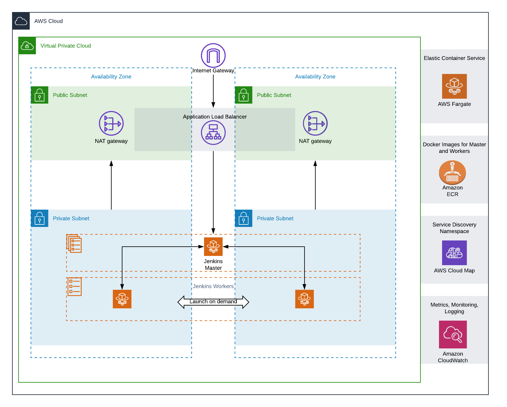

# Jenkins on AWS (TypeScript)
This project forks [Jenkins on AWS](https://github.com/aws-samples/jenkins-on-aws/) only for TypeScript and EC2.

## Architecture



## Installation
```console
$ (cd cdk && npm install)
```

## Validate configs
Navigate to the cdk directory, and run:
```console
$ (cd cdk && cdk synth)
Successfully synthesized to jenkins-on-aws/cdk/cdk.out
Supply a stack name (JenkinsNetwork, JenkinsECS, JenkinsWorker, JenkinsMaster) to display its template.
```

## Deploy
```bash
$ (cd cdk && npm run build && cdk deploy 'Jenkins*')
```
